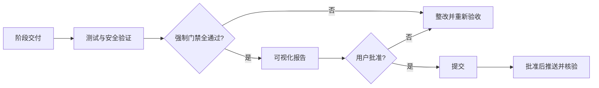

# 金融问数系统总体项目流程 V1

> 版本：V1.2｜日期：2026-09-05｜状态：待审查  
> 性质：V1 需求、设计、实施、验收、Git 交付的核心流程基线  
> 依据：《金融需求说明.md》《金融问数系统第一版项目流程提示词_v1.1_精简审定版.md》

## 1. 使用规则

本文档统一项目范围、阶段、技术、安全、验收和变更。具体任务不得绕过本文档门禁，也不得把本文档视为执行代码、安装依赖、修改数据库或推送 Git 的永久授权。

发生冲突时按以下顺序处理：用户当前明确指令 → 已批准的需求/指标/安全决策 → 本文档 → 专项契约与阶段文档 → 临时任务说明。冲突必须登记，不得自行选择有利于实现的解释。

统一状态：

| 状态 | 含义 |
| --- | --- |
| `planned` / `in_progress` | 已计划 / 已获准执行 |
| `passed` | 有可复现证据证明通过 |
| `failed` | 已验证但不满足标准 |
| `blocked` | 缺少前置条件或决策 |
| `unverified` | 尚无充分证据，不计为通过 |
| `approved` / `superseded` | 已纳入基线 / 已被新版本替代 |

## 2. 项目目标、范围与成功标准

### 2.1 目标

面向运营、产品运营、理财、信贷、风控、催收和管理人员，在权限范围内通过自然语言完成指标、明细、统计、趋势、对比和排名查询，并返回口径、范围、限制、来源和审计信息。

### 2.2 V1 范围

| 业务域 | 能力 |
| --- | --- |
| 客户 | 新增、活跃、风险等级、KYC、个人/企业客户 |
| 账户 | 正常/新增账户、余额、冻结金额、状态 |
| 交易 | 金额、笔数、失败交易、渠道、对账 |
| 理财 | 产品、订单、申购、赎回、持仓、收益、风险、适当性 |
| 信贷 | 申请、授信、审批、合同、放款、余额、通过率、状态 |
| 还款逾期 | 计划、记录、金额、提前还款、费用减免、逾期余额、合同、阶段 |
| 风控合规 | 风险事件、规则命中、黑名单、反洗钱、人工复核、处置 |
| 催收 | 案件、人员、阶段、结果、回收金额、回收率 |

分析维度包括时间、机构、渠道、客户、产品、风险、贷款、还款、逾期和催收人员；结果支持明细、汇总、趋势、对比、排名及限制说明；必须处理歧义、无数据、数据不完整、超范围、权限不足和执行失败。

### 2.3 非目标

- 写回业务数据库或自动执行审批、授信、处置、催收决策；
- 替代财务、合规、监管或人工审批结论；
- 未授权的数据出域、跨境或外部模型敏感明细传输；
- 无证据预拆微服务、采用多 Agent、独立向量库或集群编排；
- 直接 Fork 大型问数平台、接入未批准外部数据源或生产发布。

### 2.4 成功标准

- 核心指标与批准契约精确一致；
- 写操作、越权和未授权敏感信息暴露为零；
- 需求可追踪到指标、模块、安全控制、用例和证据；
- 正常、边界、异常和降级路径均有可执行验证；
- 每阶段生成可视化验收报告，经用户批准后才进入下一阶段；
- 阶段通过后按第 12 节完成 Git 提交和经批准的远程推送。

## 3. 治理与职责

核心原则：业务口径优先、安全不可绕过、契约先行、证据优先、最小变更、单一事实来源、可回滚、人工最终决策。

| 职责 | 负责 | 不得自行决定 |
| --- | --- | --- |
| 项目总控 | 范围、阶段、风险、决策、版本 | 扩项或跨阶段 |
| 业务产品 | 角色、场景、流程、验收目标 | 争议指标口径 |
| 数据治理 | 对象、指标、维度、语义、质量 | 为实现便利改变口径 |
| 前端 | 提问、澄清、状态、结果、反馈 | 权威计算、授权、脱敏 |
| 后端 | 权限、编排、查询、校验、审计 | 绕过契约或扩大范围 |
| 质量安全 | 测试、核验、安全、发布门禁 | 以“可运行”代替正确合规 |
| 运行运营 | 监控、升级、维护、改进 | 未审批修改生产口径或权限 |

任务类型使用 `BA`、`DATA`、`FE`、`BE`、`QA`、`SEC`、`INT`。每项任务记录：编号、阶段、目标、依据、允许/禁止范围、依赖契约、产出、验收、证据、未验证项、风险、回滚和下游影响。

## 4. P0：阶段一前置门禁

P0 只形成决策和授权，不自动创建工程资产。

### 4.1 必须确认

1. 数据库类型、SQL 方言、所有权和只读访问；
2. Schema 快照格式、脱敏、路径、版本和责任人；
3. 应用元数据库及 Alembic 迁移范围；
4. 测试工程、Fixture 来源、环境和验收方式；
5. Schema、指标、Fixture、代码版本映射；
6. Git 仓库根目录、远程、默认分支、认证、保护规则；
7. 允许入库和必须排除的文件；
8. 创建上述资产及首次 Git 提交/推送的逐项授权。

### 4.2 资产结论

| 资产 | 结论 | 边界 |
| --- | --- | --- |
| 业务库 Schema | 需要 | 只读结构快照、语义、血缘和版本；不得含真实敏感数据 |
| 业务库迁移 | 禁止 | 本项目不改造源业务库 |
| 应用元数据库 Schema | 需要 | 用户、角色、指标、术语、样例、会话、状态、审计 |
| 应用元数据库迁移 | 需要 | 仅用 Alembic 管理应用元数据，须可验证、可回滚 |
| 测试工程 | 需要 | 单元、集成、E2E、安全、黄金集、Fixture、报告生成 |

测试工程不等同于第一条“项目流程提示词”需求：前者提供可执行验收证据，后者定义项目功能与阶段。两者必须追踪关联，不能互相替代。

### 4.3 建议目录（P0 批准后创建）

```text
contracts/business-schema/   # 业务库只读 Schema
contracts/metrics/           # 指标与维度契约
db/app-metadata-schema/      # 应用元数据库 Schema
db/migrations/               # 仅应用元数据库迁移
tests/{unit,integration,e2e,security,evaluation,fixtures}/
docs/{acceptance,decisions}/
```

## 5. 已批准技术基线

架构采用前后端分离、逻辑模块化统一后端和单一受控 LangGraph 流程。前端不承担权威计算、授权或脱敏；后端负责规则、权限、执行、校验和审计。LLM 厂商须经合规与黄金集评测后确定。

| 层级 | 技术 | 限制 |
| --- | --- | --- |
| 前端 | React、TypeScript、Vite、Ant Design、ECharts | 问数、澄清、状态、结果、指标、审计 |
| 后端 | Python 3.11/3.12、FastAPI、Pydantic v2 | 实施前锁定 Python 小版本 |
| 数据访问 | SQLAlchemy 2、目标驱动、Alembic | Alembic 不管理业务库 |
| 编排 | LangGraph | 受控状态机、恢复、人工确认、反馈 |
| 元数据/检索 | PostgreSQL、pgvector | 指标、字段、规则、同义词、验证样例 |
| Embedding | BGE-M3 | 达到基准后定版 |
| SQL 防护 | SQLGlot、只读账号、白名单、RLS、超时、限行 | SQLGlot 不是唯一安全边界 |
| 缓存协调 | Redis | 不存权威权限或指标事实 |
| LLM 接入 | Provider Adapter | OpenAI-style API/本地推理，厂商待评测 |
| 可观测性 | OpenTelemetry、Langfuse、JSON 日志 | 串联请求、检索、模型、SQL、策略、结果 |
| 测试 | pytest、pytest-asyncio、Playwright、黄金集 | 单元、集成、E2E、回归、安全负例 |
| 部署/工程 | Docker Compose、Nginx、uv、Ruff、mypy、pnpm、ESLint | 开发、演示、单机试运行、可复现构建 |

技术变更须提交证据、影响、兼容、迁移、回滚和测试方案，经批准后更新基线。

## 6. 八阶段流程

| 阶段 | 主要步骤 | 交付物 | 通过门禁 | 验收可视化重点 |
| --- | --- | --- | --- | --- |
| 1. 立项边界 | ①确认角色/目标/范围 ②核验数据源与方言 ③确认合规出域 ④确定规模、并发、P95、超时、行数 ⑤登记风险/授权 | 立项、范围、责任、数据源、资源目标、风险清单 | P0 通过；目标/责任/真实条件获确认；性能阻断解决或排除 | 范围、责任、数据源、性能目标、阻断 |
| 2. 对象语义 | ①对象/关系/生命周期 ②统一状态/时间/金额 ③术语同义词 ④跨域关联 ⑤只读映射 Schema ⑥登记质量问题 | 对象模型、枚举、术语、物理映射、质量清单 | 对象不冲突；链路闭合；关键映射有证据 | 业务域覆盖、映射验证、冲突、质量问题 |
| 3. 指标维度 | ①指标目录 ②口径契约 ③维度层级 ④血缘/负责人 ⑤SQL 候选/Fixture ⑥争议决策 | 指标/维度契约、Fixture、口径记录、追踪表 | 核心口径唯一；血缘明确；争议批准或排除 | 指标覆盖、契约完整、血缘、Fixture、阻断 |
| 4. 问数交互 | ①理解/歧义 ②检索/计划/生成 ③校验/授权/执行 ④解释/反馈 ⑤API/事件/错误 ⑥场景推演 | 状态机、接口、事件、错误、样例 | 三个安全节点不可绕过；支持幂等、恢复、取消、追溯 | 节点完成、场景覆盖、接口、异常、安全节点 |
| 5. 权限安全 | ①权限矩阵 ②敏感分级/脱敏 ③AST/白名单/资源限制 ④只读/RLS ⑤审计 ⑥安全负例 | 权限、脱敏、安全清单、审计、威胁用例 | 写入、越权、泄漏、资源滥用均被确定性拒绝 | 权限覆盖、负例拒绝、审计、高风险缺陷 |
| 6. 实施交付 | ①追踪矩阵 ②任务拆分 ③契约所有权 ④环境/依赖/许可证 ⑤短周期实施验证 ⑥记录偏差 | 架构、任务、实现、验证、交付与变更记录 | 每项能力映射需求、契约、安全和用例；无未授权扩项 | 功能进度、追踪、测试、缺陷、技术债、回滚 |
| 7. 测试验收 | ①黄金集 ②边界/异常 ③单元/集成/E2E/安全/回归 ④模型/检索评测 ⑤结果与权限核验 ⑥门禁报告 | 测试集、脚本、评测、安全/性能/缺陷/验收报告 | 第 10 节全部强制门禁通过；核心用例无回归 | 评测得分、安全、回归、性能、缺陷分布 |
| 8. 评审交接 | ①覆盖复核 ②版本/许可/迁移/回滚 ③运行手册 ④限制/升级 ⑤知识移交 ⑥最终审批 | 综合报告、风险、手册、回滚、版本、交接 | 业务、技术、安全、评测、运维均通过并获最终批准 | 总体覆盖、发布门禁、风险、交接、回滚 |

阶段内可并行，但共享契约必须先定版，同一权威内容只由指定责任人合并。未经批准不得跨阶段。

## 7. 核心契约

### 7.1 指标契约

每个指标至少包含：`metric_id`、`business_name`、`definition`、`formula`、`grain`、`time_semantics`、`filters`、`distinct_key`、`currency`、`dimensions`、`null_policy`、`synonyms`、`lineage`、`owner`、`freshness`、`version`、`example`。

影响结果的字段缺失时不得实现或宣称可用；破坏性口径变更建立新版本并保留旧版适用期。

### 7.2 问数流程

```text
understand_question → resolve_context → check_ambiguity → retrieve_semantics
→ plan_query → generate_sql → validate_sql → authorize_query
→ execute_query → validate_result → compose_answer → record_feedback
```

重大歧义必须澄清；`validate_sql`、`authorize_query`、`validate_result` 不可跳过；失败重试不得扩大权限、范围或敏感字段。

### 7.3 接口与评测

前后端实施前定版身份上下文、任务状态、流式事件、重连、澄清、结果、错误、金额单位、空值、脱敏、指标版本和兼容策略。

黄金用例字段：`case_id`、`domain`、`question`、`actor`、`metric_contract`、`expected_scope`、`expected_behavior`、`expected_sql_properties`、`expected_result`、`actual_trace`、`verification_state`。结果等价与权限范围是主要标准；无可执行 Fixture 不得标记 `passed`。

### 7.4 Schema、迁移与测试工程

**业务 Schema**：记录数据源、方言、版本、表列类型、键/约束/视图、Join 路径、语义、敏感等级、责任人、采集时间和指标映射；不得提交生产样本、口令、连接串或敏感注释。

**应用迁移**：单一目的、顺序编号、绑定应用版本；包含升级、兼容、影响、验证和回滚；先在隔离环境验证。生产、破坏性、回填或不可逆迁移须单独批准。

**测试工程**：覆盖单元、集成、E2E、安全、黄金集和报告生成。不得复制生产敏感数据，不得为通过而修改 Fixture/期望/阈值，不得把跳过和未验证计为通过，不得连接生产写账号。结果记录代码、Schema、指标和环境版本。

## 8. NL2SQL 安全基线

执行前必须：

- 仅允许单条只读 `SELECT` 或等价查询；
- 解析 AST，并对白名单目录、Schema、表、列、函数、Join 路径校验；
- 在模型之外注入角色、租户、机构、表列行权限；
- 对敏感数据脱敏、聚合、最小披露；
- 强制时间、行数、超时、内存和并发预算；必要时做成本预检。

必须拒绝：DDL/DML、事务、多语句、授权/会话变更、导入导出、文件/网络访问、扩展、不安全 UDF、存储过程、临时对象、未知对象、越权、无界或超预算查询。

执行后记录操作者、角色、租户/机构、问题、指标版本、查询哈希、策略、数据时间、耗时、行数、结果和追踪标识；不得记录密钥、隐藏 Prompt 或非必要敏感原文。

## 9. 每阶段可视化验收报告

每阶段结束生成独立 Markdown 报告，建议路径 `docs/acceptance/stage-XX-acceptance-vN.md`。目录未批准前保存在项目文档区。

### 9.1 强制内容

- 阶段、版本、范围、责任人、日期和四态结论；
- 功能实施矩阵、交付物与证据定位；
- 需求→指标→实现→安全→用例追踪；
- 测试、缺陷、风险、门禁、遗留和回滚；
- 用户批准记录、Commit SHA、远程分支与推送状态。

### 9.2 最小可视化



| 功能/交付 | 实施 | 测试 | 安全 | 证据 | 结论 |
| --- | --- | --- | --- | --- | --- |
| 按阶段填写 | 四态 | 四态 | 四态 | 可访问定位 | 四态 |

| 类别 | 总数 | 通过 | 失败 | 阻断 | 未验证 | 通过率 |
| --- | ---: | ---: | ---: | ---: | ---: | ---: |
| 功能/契约/测试/安全 | 实际值 | 实际值 | 实际值 | 实际值 | 实际值 | 按纳入项计算 |

状态分布可使用 Mermaid 饼图，但必须填真实计数。所有图表须同时提供文字状态和数据表；数字必须追溯到用例、日志、文件、查询哈希或评审记录。不得隐藏失败/跳过/例外，不得用截图作为唯一证据，不得包含敏感数据。图表与底层证据不一致时报告为 `failed`。

## 10. V1 强制验收门禁

| 维度 | 标准 |
| --- | --- |
| 越权、跨租户/机构、写入、危险访问、未授权 PII | 0 次容忍，任一失败即阻断 |
| 核心指标 Fixture | 100% 与批准契约等价 |
| 计数、排名、状态、金额 | 按批准规则精确一致 |
| 比率 | 分子分母精确，最终展示误差 ≤ 0.01 个百分点 |
| 核心时间/时区边界、重大歧义澄清 | 100% 正确 |
| 黄金集意图/指标选择 | ≥95% |
| 黄金集执行 | ≥95%，核心用例 100% |
| 解释/血缘 | ≥98%，核心指标 100% |
| BGE-M3 | Recall@5 ≥95%，MRR ≥0.85，否则保持候选 |
| 回归 | 已批准核心用例 0 个新增失败 |

P95、查询超时、最大行数、内存和并发预算须依据真实数据与环境在阶段一批准；此前为 `blocked`。验收以指标契约、权限、结果等价和追溯为准，不要求 SQL 文本完全一致。

## 11. 项目节奏与交付追踪

```text
确认阶段输入 → 拆分周期任务 → 执行 → 验证留证
→ 生成阶段报告 → 用户批准/退回 → 更新基线 → 下一阶段
```

每个周期明确目标、责任人、依赖、验收和证据；至少每周同步完成项、偏差、风险和阻断。每项需求形成：

```text
需求 → 场景 → 对象/指标 → 权限 → 接口/模块 → 用例 → 证据 → 发布状态
```

链路断点标记 `blocked` 或 `unverified`。

核心资产：总体流程、立项边界、对象语义、指标契约、接口契约、安全规范、Schema/迁移记录、测试工程、阶段验收报告、运行交接、Git 同步记录。

## 12. Git 提交与 GitHub 同步

目标远程：`https://github.com/yefeng7331/Financial_Data_Analysis`，建议远程名 `origin`。

### 12.1 当前核验状态

- 本地仓库已初始化，`main` 跟踪 `origin/main`；
- GitHub CLI 已认证账号 `yefeng7331`；
- 远程仓库已验证为公开仓库，默认分支为 `main`，当前账号权限为 `ADMIN`；
- 远程原始基线为 `99fe3a9`（`Initial commit`），项目提交不得覆盖或重写该历史。

### 12.2 一次性准备

1. 核验 GitHub 账号、目标仓库、权限、可见性和默认分支；
2. 确认仓库根目录及提交范围；
3. 创建并审查 `.gitignore`，排除临时目录、环境、密钥、数据库、生产数据、敏感日志和构建物；
4. 执行秘密、敏感数据和大文件扫描；
5. 初始化 Git、绑定 `origin`；
6. 展示首次提交摘要并取得提交批准；
7. 提交后再次取得 `git push` 批准；
8. 推送并读取远程 SHA，核对文件和分支。

### 12.3 每阶段流程

```text
验收 passed → 检查门禁/敏感数据/Git 差异 → 展示变更摘要
→ 批准提交 → 记录本地 SHA → 再批准 push
→ 推送指定分支 → 核验远程 SHA/文件 → 回填报告
```

阶段验收通过不等于永久推送授权。每次 `git push` 都需明确批准。默认分支以远程实际设置为准；受保护时使用阶段分支和 Pull Request。提交信息使用简洁英文：`<type>(stage-XX): <summary>`。

必须停止提交/推送的情况：门禁失败或阻断；报告与代码不一致；含无关修改、秘密、敏感/生产数据或未批准的 `.env`、CI/CD、迁移、依赖；远程身份/分支未验证；存在未知远程提交；需要变基、强推、重写或删除历史。

同步记录：阶段、文档版本、报告、结论、摘要、本地/远程分支、两端 SHA、批准记录、核验时间和异常。

## 13. 变更、版本与风险

范围、指标、权限、数据出域、技术栈、Schema、接口、阈值、模型、数据源或部署变化必须走：

```text
提出 → 证据 → 影响评估 → 兼容/迁移/回滚/测试
→ 审批 → 更新权威文档与追踪 → 实施验证 → 关闭
```

批准前只作为候选。`V1.x` 用于 V1 内澄清和兼容更新；重大范围、架构或契约变化升为 `V2.0`。旧版保留追溯。

风险记录：编号、描述、概率、影响、证据、责任人、措施、触发、状态、期限。重大决策记录候选、依据、影响、批准人、日期、版本。争议指标、权限、数据出域、阈值放宽和发布例外不得只留在聊天中。

技术升级仅由证据触发：pgvector 性能/隔离不足再评估独立向量库；高可用/弹性需要再评估集群；独立扩缩容/合规隔离需要再拆服务；黄金集证明单流程不足再评估多 Agent。

## 14. 全局红线

未经当次明确批准，不得：

1. 删除文件、目录、测试基准或 Git 历史；
2. 修改 `.env`、密钥、Token、证书、CI/CD；
3. `git push`、`git rebase`、`git reset --hard`、强推或公开发布；
4. 自动提交 Git；提交前必须展示摘要；
5. 安装、升级、移除依赖；
6. 创建、迁移、清空或修改数据库；业务库迁移始终禁止；
7. 改变技术栈、指标、权限或验收阈值；
8. 将生产数据、数据库文件、连接串、秘密或未脱敏信息加入 Git；
9. 为通过而修改/隐藏 Fixture、期望、失败用例或报告；
10. 在远程、账号、分支未验证时推送。

触发红线时停止相关动作，报告目标、风险、范围、恢复方式和所需批准。“继续”或某阶段批准不自动扩大到其他红线操作。

## 15. 补充能力优先级

| 级别 | 必须落实 |
| --- | --- |
| P0：相关实施前 | 数据分级/仓库排除；版本溯源；备份恢复与迁移回滚；Schema 漂移影响；远程身份权限；秘密/供应链检查 |
| P1：V1 最终验收前 | 数据质量与新鲜度；SLO/降级；审计/事件响应；模型与 Prompt 版本；验收图表和底表一致性 |
| P2：基线稳定后 | 成本容量趋势；可访问性；反馈效果；文档复审提醒 |

P0 未落实不得进入相关实施或远程同步；P1 未落实不得通过 V1 最终验收；P2 进入改进计划并说明风险。

## 16. 版本记录与下一步

| 版本 | 状态 | 摘要 |
| --- | --- | --- |
| V1.0 | `superseded` | 建立范围、八阶段、技术、安全和门禁 |
| V1.1 | `superseded` | 增加可视化验收、P0 资产决策、Git 流程、优先级 |
| V1.2 | 待审查 | 合并重复规则与模板，保留有效决策，降低阅读 Token |

当前仍未执行 P0、Schema、迁移、测试工程或项目实施。Git 初始化和首次提交/推送只在完成提交范围与远程核验后执行，并须留下本地/远程 SHA 证据。
